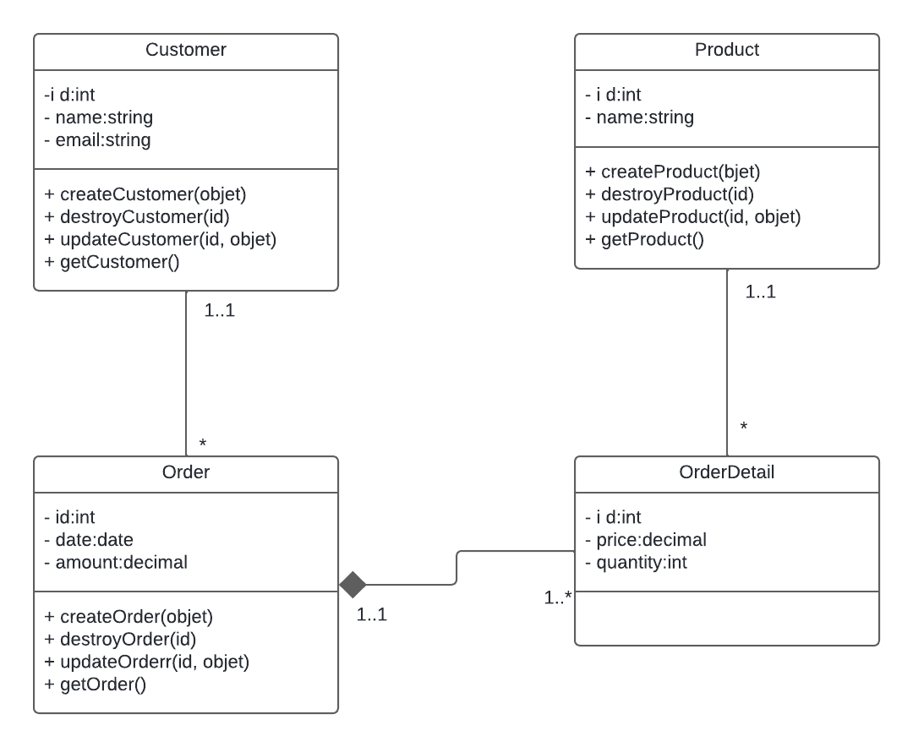

# Gestion de Commande 

Ce projet implémente un système de gestion de commande en express. Le système permet de créer, lire, mettre à jour et supprimer des clients et des produit.

## Installation
- initialisé le projet: `npm init`
- express : `npm i express`
- bodyParser: `npm i body-parser`
- nodemon: `npm i nodemon`
- Clonez ce dépôt :

    ```bash
        git clone https://github.com/Ousmanly/gestion-commande-express.git
    ```

## Utilisation

-  Accédez au répertoire du projet :

    ```bash
        cd composant-metier
    ```
- Lancer le projet : `npm start`
## UML

## Author
- **GitHub** : [Ousmane Ly](https://github.com/Ousmanly)
- **LinkedIn** : [Ousmane Ly](www.linkedin.com/in/ousmane-ibrahima-ly-a270a4290)
